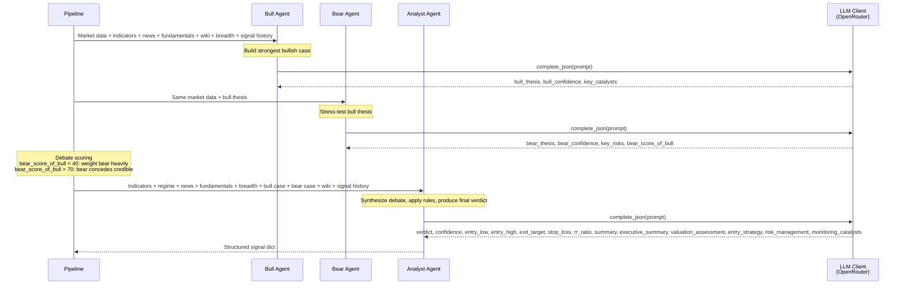

# Sora Trading Bot (v2)

Personal-use Telegram-based AI trading signal agent for US equities and cryptocurrency. Provides entry/exit zone signals with full reasoning through a deterministic technical pipeline augmented by multi-agent LLM debate. No user interface, no trading execution -- signals only.

## Table of Contents

- [Overview](#overview)
- [Features](#features)
- [Architecture](#architecture)
- [Tech Stack](#tech-stack)
- [Project Structure](#project-structure)
- [Signal Pipeline](#signal-pipeline)
- [Strategy Engine](#strategy-engine)
- [LLM Agent Pipeline](#llm-agent-pipeline)
- [Scheduler](#scheduler)
- [Memory System](#memory-system)
- [Database](#database)
- [Installation](#installation)
- [Configuration](#configuration)
- [Usage](#usage)
- [Telegram Commands](#telegram-commands)
- [Extending](#extending)

## Overview

Sora is an automated trading signal generator that runs as a single asyncio Python process. It combines a deterministic technical analysis engine with a multi-agent LLM debate system to produce high-quality trading signals for US equities (via Alpaca) and cryptocurrencies (via Binance/CoinGecko).

The system operates on a simple principle: **trade less, trade higher quality**. Every signal passes through multiple quality gates -- technical indicators, market regime detection, confidence scoring, confluence validation, and a hard signal gate -- before being delivered via Telegram.

Key architectural decisions:

- Single-process asyncio design with no external message broker or task queue
- SQLite for persistence (no database server required)
- All confidence scores are deterministic and explainable
- LLM is used as an augmentation layer, not the core decision-maker
- Resilient to data source failures (graceful fallbacks throughout)

## Features

**Multi-Market Coverage**
- US equities: NASDAQ/NYSE symbols via Alpaca Markets API (daily OHLCV bars)
- Cryptocurrency: BTC, ETH, SOL, BNB, AVAX, LINK, DOT, MATIC, ADA, XRP via Binance public API (no key required)
- Market regime detection using SPY (equities) or BTC (crypto) as proxies

**Five Built-in Trading Strategies**
1. EMA + RSI + Volume -- trend-following with EMA alignment, RSI momentum, and volume confirmation (Easy, Bull/Neutral)
2. Supertrend + MACD -- trend-following with Supertrend direction and MACD crossover confirmation (Medium, Bull/Volatile/Neutral)
3. Bollinger Squeeze -- captures breakouts following volatility contraction (Medium, Bull/Volatile/Ranging)
4. RSI Mean Reversion -- mean reversion using RSI extremes, buys oversold, sells overbought (Easy, Ranging/Volatile/Neutral)
5. VWAP Momentum -- momentum strategy keying off VWAP crossovers with volume and RSI filters (Advanced, Bull/Neutral/Volatile)

**Deterministic Confidence Scoring**
Seven explainable dimensions weighted to produce a 0-100 score:
- Trend strength (ADX, EMA alignment)
- Signal alignment (RSI, MACD, Bollinger Bands)
- Volatility quality (ATR % of price, vol vs historical)
- Volume confirmation (volume ratio, vol trend)
- Market regime fit (strategy compatibility with current regime)
- Historical performance (win rate, Sharpe ratio)
- Drawdown state (current vs max drawdown)

**Market Regime Detection**
Classifies market as BULL, BEAR, NEUTRAL, RANGING, or VOLATILE using ADX, trend slope, and volatility relative to historical baseline. Each regime influences which strategies are eligible and how confidence is calculated.

**Confluence Validation**
Before accepting any signal, the system validates that technical factors agree: ADX strength, EMA alignment with signal direction, RSI consistency, volume confirmation, and regime compatibility. The alignment ratio must be >= 50%.

**Signal Gate (Pre-Notification Filter)**
Eight hard rules that any BUY/SELL signal must pass before being delivered:
- Mandatory: R:R >= 1.5:1, entry zone active
- Scorecard: confidence floor (70/75), RSI max for longs, volume confirmation, post-catalyst cooldown (7 days), stop-loss sanity
- Allows 1 failure out of 5 scorecard checks

**Multi-Agent LLM Analysis**
- Bull Agent: builds the strongest bullish case from provided data
- Bear Agent: stress-tests the bull thesis, identifies hidden risks
- Analyst Agent: synthesizes bull vs bear debate into final verdict
- Debate scoring: Bear rates the bull thesis (0-100), weighting synthesis accordingly

**Moomoo Framework**
5-step structured analysis methodology (Objective, Data Collection, Multi-Dimensional Analysis, Synthesis, Structured Report) for comprehensive stock research including valuation assessment, entry strategy, and risk management.

**Pre-Execution Filters**
- Earnings calendar proximity (blackout within 3 days)
- Liquidity check (min 300K avg volume, penny stock filter, price ceiling)
- Volume environment (dead market, manipulation spike detection)
- Bid-ask spread check
- ATR pre-gate (minimum 0.3% daily range for tradeable setups)
- Earnings proximity guard (HIGH risk flag within 5 days)

**Automated Scanning**
- US equities: pre-market (8:30 ET) and pre-close (15:00 ET) scans
- Crypto: every 4 hours
- Position monitoring: every 30 min during market hours (US), every 2 hours (crypto)
- News scanning: per-symbol headline delivery during scans
- Weekly review: autonomous strategy evaluation and lessons extraction

**Position Tracking**
- Log entries with entry price, stop-loss, take-profit, quantity
- Automatic SL/TP monitoring and alerts
- Close positions on SL hit or TP reached

**LLM-Powered Memory**
- Karpathy-style wiki: persistent LLM-maintained trading wiki with strategy, patterns, lessons, regime, and per-symbol pages
- Wiki ingestion: user notes and trade feedback are LLM-analyzed and merged into wiki files
- Wiki linting: automated consistency and contradiction checking
- Autoresearch loop: weekly review agent evaluates signal accuracy, updates lessons, identifies patterns

**User Profile**
Automatically extracted from wiki content: risk tolerance, preferred timeframes, favorite strategies, max position size, common mistakes.

**Feedback Loop**
- Trade outcomes logged (took/skip/partial with reasons)
- Signal outcomes tracked (3d, 7d, 14d returns)
- Outcome-adjusted conviction: historical BUY accuracy per symbol influences LLM analysis
- Lessons extracted from user behavior and signal accuracy

**Telegram Chat Interface**
- Free-form trading chat with LLM-powered responses
- Tool-using agent: can analyze symbols, fetch signals, query watchlist and lessons on demand
- Chat history maintained for conversational context

**Rich Signal Reports**
- HTML-formatted messages with entry zones, exit targets, stop-loss, R:R ratio
- Confidence breakdown visualization
- Technical condition assessment (RSI, Stoch, Williams %R, Bollinger Bands)
- Signal gate scorecard
- Full LLM reports include bull case, bear case, catalysts, and risks

**Chart Generation**
Candlestick charts with matplotlib/mplfinance:
- EMA21 and EMA55 overlays
- Entry zone highlight (green band)
- Stop-loss and take-profit levels annotated
- Dark theme (dark background, green/red candles)

## Architecture

### System Architecture Diagram

```mermaid
graph TB
    subgraph Entry
        BOT[bot.py<br/>asyncio Runner]
    end

    subgraph Telegram
        TH[TelegramHandler<br/>polling + routing]
        FMT[formatter.py<br/>HTML reports]
        CHART[chart.py<br/>candlestick PNGs]
    end

    subgraph Engine
        ORCH[orchestrator.py<br/>Signal Pipeline]
        STRAT[strategies.py<br/>5 Strategies]
        CONF[confidence.py<br/>7-dimension scoring]
        REG[regime.py<br/>Market Regime]
        FILT[filters.py<br/>Pre-execution filters]
        GATE[signal_gate.py<br/>8-rule gate]
    end

    subgraph Data
        US[us_feed.py<br/>Alpaca API]
        CRYPTO[crypto_feed.py<br/>Binance API]
    end

    subgraph Analysis
        NEWS[news.py<br/>Yahoo RSS + CryptoPanic]
        SENT[sentiment.py<br/>Keyword scoring]
        FUND[fundamental.py<br/>FMP API]
        EARN[earnings.py<br/>yfinance calendar]
        BRD[breadth.py<br/>S&P500 BPI]
        MOOMOO[moomoo.py<br/>5-step framework]
    end

    subgraph LLM
        CLIENT[client.py<br/>OpenRouter + caching]
        ANALYST[analyst.py<br/>Bull/Bear/Analyst agents]
        REP[reporter.py<br/>Signal formatting]
    end

    subgraph Memory
        WIKI[wiki.py<br/>File-based wiki]
        LEARN[learner.py<br/>Weekly review]
        FB[feedback.py<br/>Trade feedback]
        PROF[profile.py<br/>User profile]
    end

    subgraph Scheduler
        DMN[daemon.py<br/>Cron scanning]
    end

    subgraph Database
        DB[(SQLite<br/>sora.db)]
    end

    BOT --> TH
    BOT --> DMN
    TH --> ORCH
    DMN --> ORCH
    ORCH --> US
    ORCH --> CRYPTO
    ORCH --> REG
    ORCH --> STRAT
    ORCH --> CONF
    ORCH --> GATE
    ORCH --> NEWS
    ORCH --> FUND
    ORCH --> BRD
    ORCH --> EARN
    ORCH --> WIKI
    ORCH --> ANALYST
    ANALYST --> CLIENT
    ANALYST --> MOOMOO
    TH --> CLIENT
    TH --> FMT
    TH --> CHART
    TH --> DB
    DMN --> DB
    DMN --> NEWS
    DMN --> WIKI
    LEARN --> DB
    LEARN --> WIKI
    FB --> WIKI
    FB --> DB
    PROF --> WIKI
    PROF --> DB
    WIKI -.->|files| KNOWLEDGE[(knowledge/wiki/)]
```



### Signal Pipeline Flow

```mermaid
flowchart LR
    START([Watchlist Symbol]) --> FETCH{Market Type}
    FETCH -->|US Equity| ALPACA[Alpaca API<br/>90d daily bars]
    FETCH -->|Crypto| BINANCE[Binance API<br/>90d daily bars]

    ALPACA --> IND[Indicator Engine]
    BINANCE --> IND

    IND --> REGDET[Market Regime<br/>ADX + Trend + Vol]
    IND --> STRATSELECT[Strategy Selector<br/>regime-compatible<br/>strategies evaluated]

    REGDET --> CONFEVAL[Confidence Engine<br/>7 dimensions]
    STRATSELECT --> CONFEVAL

    CONFEVAL --> CONFIDENCE{Confidence OK?}

    CONFIDENCE -->|REJECT| HOLD1[HOLD<br/>Low confidence]
    CONFIDENCE -->|LOW/MEDIUM/HIGH| CONFLUENCE[Confluence Validator<br/>ADX + EMA + RSI + Vol + Regime]

    CONFLUENCE -->|alignment >= 50%| SIGNAL_GATE[Signal Gate<br/>8 rules]
    CONFLUENCE -->|alignment < 50%| HOLD2[HOLD<br/>Confluence rejected]

    SIGNAL_GATE -->|passed| LLM_LAYER{Full analysis?}
    SIGNAL_GATE -->|failed| HOLD3[HOLD<br/>Gate rejected]

    LLM_LAYER -->|yes| BULL_AGENT[Bull Agent]
    LLM_LAYER -->|no| RESULT[Direct Signal]

    BULL_AGENT --> BEAR_AGENT[Bear Agent]
    BEAR_AGENT --> ANALYST_AGENT[Analyst Agent]

    ANALYST_AGENT --> VERDICT[BUY / SELL / HOLD]
    RESULT --> DELIVERY[Telegram Report]
    VERDICT --> DELIVERY

    DELIVERY --> CHART[Chart PNG]
    DELIVERY --> REPORT[HTML Signal Report]

    REPORT --> DB[(SQLite)]
```



### LLM Agent Pipeline



## Tech Stack

| Component | Technology | Purpose |
|-----------|-----------|---------|
| Runtime | Python 3.14+ asyncio | Single-process event loop |
| Telegram Bot | python-telegram-bot (polling) / raw httpx | Message delivery and command handling |
| US Market Data | Alpaca Markets API (alpaca-py) | Daily OHLCV bars for US equities |
| Crypto Data | Binance public API (requests) | Daily OHLCV bars for cryptocurrency |
| Regime Data | Alpaca (SPY) / CoinGecko (BTC) | Market regime detection reference |
| News | Yahoo Finance RSS / CryptoPanic RSS | News headline aggregation |
| Fundamentals | Financial Modeling Prep (FMP) | P/E, revenue growth, insider trading, institutional ownership |
| Valuation | Financial Modeling Prep (FMP) | P/B, P/S, PEG, EV/EBITDA, ROE, ROA, analyst estimates |
| Earnings Calendar | yfinance | Earnings proximity detection |
| Market Breadth | yfinance (S&P500 BPI) | S&P 500 Bullish Percent Index |
| Technical Charts | matplotlib + mplfinance | Candlestick chart generation |
| LLM API | OpenRouter (httpx) | Multi-model access through single API |
| Database | SQLite (sqlite3) | Persistent storage (no DB server) |
| Scheduler | Custom asyncio loop | Cron-based market scanning |
| Logging | Standard logging + custom colored formatter | Structured log output |
| Config | python-dotenv | Environment variable management |
| Testing | pytest + pytest-asyncio | Test suite |

## Project Structure

```
noor-telegram-bot/
  bot.py                      # Entry point -- asyncio runner, initializes DB and starts Telegram + Scheduler
  log.py                      # Colored logging formatter with HTTP-level support

  engine/
    orchestrator.py            # Main signal pipeline: fetch bars, compute indicators, detect regime,
                               #   select strategy, score confidence, validate confluence, run signal gate,
                               #   optionally trigger LLM analysis. Entry points: run_pipeline(), run_analysis()
    strategies.py              # 5 built-in strategies (EMA+RSI+Vol, Supertrend+MACD, Bollinger Squeeze,
                               #   RSI Mean Reversion, VWAP Momentum) with registry and StrategySelector
    confidence.py              # 7-dimension deterministic confidence engine (0-100) with verdicts:
                               #   REJECT (<35), LOW (35-55), MEDIUM (55-75), HIGH (>=75)
    regime.py                  # Market regime detection: BULL, BEAR, NEUTRAL, RANGING, VOLATILE
                               #   via ADX + trend slope + volatility analysis on SPY or BTC
    filters.py                 # Pre-execution filters: earnings proximity, liquidity, volume environment,
                               #   spread. Returns FilterResult with pass/block/warn severity
    signal_gate.py             # Hard pre-notification gate: 8 rules (2 mandatory: R:R>=1.5, entry zone;
                               #   5 scorecard: confidence floor, RSI, volume, news cooldown, stop sanity)

  telegram/
    handler.py                 # Telegram bot with long-polling update loop. Routes 20+ slash commands,
                               #   handles free-form chat with tool-using LLM agent (analyze, signals,
                               #   watchlist, lessons). Manages chat history and async message dispatch
    formatter.py               # HTML formatters for signal reports, watchlist, system status, regime,
                               #   help text, backtest results, history, positions, SL alerts, news alerts,
                               #   profile. Confidence bars with Unicode block characters
    chart.py                   # Candlestick chart generator using mplfinance (primary) or matplotlib (fallback).
                               #   Dark theme, EMA21/EMA55 overlays, entry zone band, SL/TP annotations

  data/
    us_feed.py                 # US equities OHLCV via Alpaca StockHistoricalDataClient. 90-day daily bars.
                               #   Returns empty list on failure (no mock data)
    crypto_feed.py             # Crypto OHLCV via Binance klines API. Maps symbols to USDT pairs.
                               #   No API key required. Same dict format as us_feed for pipeline compatibility

  analysis/
    news.py                    # News fetcher: Yahoo Finance RSS for US equities, CryptoPanic RSS for crypto.
                               #   Returns title, summary, URL, published_at per article
    sentiment.py               # Keyword-based sentiment analysis on fetched news headlines.
                               #   Returns overall (bullish/bearish/neutral) and score (-1 to 1)
    fundamental.py             # Fundamentals via FMP API: company profile (P/E, revenue growth, sector),
                               #   insider trading, institutional ownership. Also valuation metrics:
                               #   P/B, P/S, PEG, EV/EBITDA, ROE, ROA, analyst estimates
    earnings.py                # Earnings proximity guard. Returns days-to-earnings and HIGH/LOW risk flag
                               #   using yfinance Ticker.calendar. Crypto always returns LOW
    breadth.py                 # S&P 500 Bullish Percent Index via yfinance. Returns weak/neutral/strong
                               #   signal for breadth-based BUY signal penalization or support
    moomoo.py                  # 5-step structured analysis framework: Objective, Data Collection,
                               #   Multi-Dimensional Analysis (Fundamental + Valuation + Technical),
                               #   Synthesis, Structured Report. Used by Moomoo analysis mode

  llm/
    client.py                  # OpenRouter API client with: configurable models, token bucket rate limiter
                               #   (4 RPM), SQLite-backed response cache (5hr TTL), exponential backoff
                               #   retry (max 5), JSON extraction from LLM responses, tool-call support
    analyst.py                 # Multi-agent analysis: Bull Agent (builds bullish case), Bear Agent
                               #   (stress-tests bull thesis with debate scoring), Analyst Agent (synthesizes
                               #   into final verdict). Also analyze_quick() and analyze_moomoo()
    reporter.py                # Signal report builder: confidence bars, confidence breakdown formatting,
                               #   JSON response parser with code block stripping

  db/
    store.py                   # SQLite persistence layer. 7 tables: watchlist, signals, signal_outcomes,
                               #   user_feedback, user_profile, agent_lessons, llm_cache, positions.
                               #   Includes signal history formatting and win-rate calculations

  scheduler/
    daemon.py                  # Asyncio-based cron daemon polling every 30 seconds. Schedules:
                               #   US scans (pre-market 8:30 ET, pre-close 15:00 ET), crypto scans (every 4h),
                               #   position monitoring (US: 30min, crypto: 2h), news scanning,
                               #   weekly review (Sunday 20:00 ET). NYSE holiday-aware

  memory/
    wiki.py                    # Karpathy-style LLM-maintained wiki. File-based persistent storage in
                               #   knowledge/wiki/. Supports ingest_note(), query_wiki(), lint_wiki().
                               #   LLM decides which wiki sections to update based on new input
    learner.py                 # Weekly review agent: evaluates signal accuracy, updates lessons.md,
                               #   extracts new patterns, identifies strategy over/underperformance
    feedback.py                # Trade feedback processor: logs user actions, triggers wiki ingestion
    profile.py                 # User profile extraction from wiki content via LLM. Fields: risk tolerance,
                               #   preferred timeframes, favorite strategies, max position size, mistakes

  knowledge/
    wiki/                      # LLM-maintained wiki files
      strategy.md              # Active trading strategies and rules
      patterns.md              # Recognized chart patterns
      lessons.md               # Accumulated lessons from review cycles
      regime.md                # Market regime observations
      symbols/                 # Per-symbol wiki pages
    raw/                       # Raw input log for wiki ingestion

  tests/                       # Test suite (pytest)
    test_breadth.py
    test_crypto_feed.py
    test_daemon_schedule.py
    test_earnings.py
    test_realtime_prices.py
    test_signal_quality.py

  docs/                        # Documentation artifacts
    sora_bot_arch.json         # Architecture metadata
    superpowers/               # Superpowers skill documentation

  graphify-out/                # Knowledge graph visualization output
    graph.html                 # Interactive knowledge graph (reference)
```

## Strategy Engine

The strategy engine uses a **conditional scoring** paradigm. Each strategy defines a set of boolean checks (conditions), counts how many pass, and computes a score as `(conditions_met / total_checks) * 100`. A minimum threshold must be met for a signal to be emitted.

| Strategy | Category | Difficulty | Compatible Regimes | Min Conditions | Risk (SL/TP) |
|----------|----------|-----------|--------------------|----------------|--------------|
| EMA + RSI + Volume | Trend | Easy | BULL, NEUTRAL | 4/6 | 6%/12% |
| Supertrend + MACD | Trend | Medium | BULL, VOLATILE, NEUTRAL | 3/5 | 5%/10% |
| Bollinger Squeeze | Breakout | Medium | BULL, VOLATILE, RANGING | 3/5 | 7%/14% |
| RSI Mean Reversion | Mean Reversion | Easy | RANGING, VOLATILE, NEUTRAL | 2/4 | 4%/7% |
| VWAP Momentum | Intraday | Advanced | BULL, NEUTRAL, VOLATILE | 3/5 | 5%/10% |

The `StrategySelector` iterates over all regime-compatible strategies, evaluates each, and selects the one with the highest blended score (signal confidence contribution weighted against optional historical confidence scores).

## Scheduler

The daemon runs a 30-second polling loop and triggers scans based on time and market conditions:

| Scan | Schedule | Market | Symbols |
|------|----------|--------|---------|
| US Pre-market | 8:30 AM ET (trading days) | US | Watchlist (market=us) |
| US Pre-close | 3:00 PM ET (trading days) | US | Watchlist (market=us) |
| Crypto | Every 4 hours, :00 | Crypto | Watchlist (market=crypto) |
| Position Scan (US) | Every 30 min during market hours | US | Open positions |
| Position Scan (Crypto) | Every 2 hours at :30 | Crypto | Open positions |
| News Scan | After each market scan | Per market | Scanned symbols |
| Weekly Review | Sunday 20:00 ET | All | All signals |

The scheduler is NYSE holiday-aware. During US scans, if a BUY signal's real-time price exceeds the entry zone by more than 5%, it is skipped. Entry zones are tightened to real-time price (+-0.3% for US, +-0.5% for crypto).

## Memory System

The memory system implements a Karpathy-style LLM wiki:

```
knowledge/
  wiki/
    strategy.md        # Active trading strategies, rules, and configurations
    patterns.md        # Chart patterns the LLM has identified
    lessons.md         # Accumulated lessons from weekly reviews and trade feedback
    regime.md          # Market regime observations and notes
    symbols/
      AAPL.md          # Per-symbol wiki pages
      BTC.md
      ...
  raw/
    inputs.log         # Raw input log for audit trail
```

**Wiki Ingestion**: When a user submits a note or trade feedback, the LLM reads the current wiki content and the new input, then decides which sections to update. It returns a JSON dict mapping filenames to full new content. Only the files that change are written.

**Wiki Linting**: An LLM-driven audit checks for contradictions, stale claims, orphan pages, and data gaps. Returns a structured issue report with severity levels.

**Weekly Review**: The ReviewAgent evaluates all signals from the past week against actual outcomes, identifies which strategies over/underperformed, updates confidence weights, and extracts new behavioral patterns. Results are merged into lessons.md.

## Database

SQLite database (`sora.db`) with 7 tables:

| Table | Purpose | Key Columns |
|-------|---------|-------------|
| `watchlist` | Symbols to scan | symbol, market, added_at |
| `signals` | Generated signals | symbol, market, verdict, confidence, entry_low, entry_high, exit_target, stop_loss, rr_ratio, strategy, regime |
| `signal_outcomes` | Actual returns | signal_id, actual_return_3d/7d/14d |
| `user_feedback` | Trade actions | symbol, action (took/skip/partial), reason, emotional_state |
| `user_profile` | Trading profile | profile_json (JSON blob) |
| `agent_lessons` | LLM-learned lessons | lesson_type, symbol, pattern, confidence_impact |
| `llm_cache` | LLM response cache | input_hash, output, model, expires_at |
| `positions` | Open/closed positions | symbol, entry_price, qty, stop_loss, take_profit, status |

## Installation

```bash
# Clone the repository
git clone <repository-url>
cd noor-telegram-bot

# Create virtual environment
python -m venv .venv
source .venv/bin/activate  # On Windows: .venv\Scripts\activate

# Install dependencies
pip install -r requirements.txt

# Configure environment
cp .env.template .env
# Edit .env with your API keys (see Configuration below)

# Initialize the database
python -c "from db.store import init_db; init_db()"

# Start the bot
python bot.py
```

## Configuration

All configuration is via environment variables (loaded from `.env`):

| Variable | Required | Description |
|----------|----------|-------------|
| `TELEGRAM_BOT_TOKEN` | Yes | Telegram bot token from @BotFather |
| `TELEGRAM_CHAT_ID` | Yes | Target chat ID for signal delivery |
| `OPENROUTER_API_KEY` | Yes | OpenRouter API key for LLM access |
| `ALPACA_API_KEY` | Yes* | Alpaca Markets API key (US equities) |
| `ALPACA_SECRET_KEY` | Yes* | Alpaca Markets secret key |
| `FMP_API_KEY` | No | Financial Modeling Prep key (fundamentals) |
| `FINNHUB_API_KEY` | No | Finnhub API key (real-time prices) |
| `DB_PATH` | No | SQLite database path (default: sora.db) |
| `DEFAULT_MODEL` | No | Default LLM model (default: openrouter/free) |
| `FAST_MODEL` | No | Fast LLM model for bull/bear agents (default: openrouter/free) |
| `ANALYSIS_MODEL` | No | Analysis LLM model for synthesis (default: openrouter/free) |

*Required for US equities. Crypto works without Alpaca keys.

The bot gracefully degrades when optional API keys are missing -- fundamentals, valuation, and real-time price features will be disabled but core signal generation continues.

## Usage

```bash
# Start the bot (runs until Ctrl+C)
python bot.py

# Run tests
pytest tests/ -v

# Initialize/reset database
python -c "from db.store import init_db; init_db()"
```

The bot starts two concurrent asyncio tasks:
1. **Telegram polling loop**: receives commands and chat messages, delivers reports
2. **Scheduler daemon**: runs automated scans at market-appropriate times

## Telegram Commands

### Analysis
| Command | Description |
|---------|-------------|
| `/analyze SYMBOL` | Quick technical signal (~30s) |
| `/analyze SYMBOL -full` | Deep multi-agent LLM report (~90s) |
| `/analyze SYMBOL -mm` | Moomoo 5-step framework analysis |
| `/analyze SYMBOL -swing` | Force swing timeframe |
| `/analyze SYMBOL -long` | Force long-term timeframe |

### Watchlist
| Command | Description |
|---------|-------------|
| `/watchlist -add SYMBOL` | Add symbol to watchlist |
| `/watchlist -remove SYMBOL` | Remove symbol from watchlist |
| `/watchlist -ls` | List all watchlist symbols |

### Positions
| Command | Description |
|---------|-------------|
| `/position -add SYMBOL PRICE [QTY] [sl:X] [tp:X]` | Log a new position |
| `/position -ls` | List open positions |
| `/position -close SYMBOL` | Close a position |

### Knowledge
| Command | Description |
|---------|-------------|
| `/note "text"` | Save a free-form thought |
| `/note -symbol SYMBOL "text"` | Save a symbol-specific note |
| `/strategy add "rule"` | Add a strategy rule |
| `/wiki TOPIC` | View wiki page (strategy, patterns, lessons, regime, or symbol) |

### Feedback
| Command | Description |
|---------|-------------|
| `/trade SYMBOL took\|skip\|partial [reason]` | Log trade action |
| `/history SYMBOL 7d` | View signal history |

### Drill-Down
| Command | Description |
|---------|-------------|
| `/reasoning SYMBOL` | Technical breakdown (LLM-powered) |
| `/backtest SYMBOL 6m` | Backtest strategies on symbol |
| `/catalyst SYMBOL` | News catalyst analysis |
| `/sentiment SYMBOL` | Sentiment analysis |
| `/why SYMBOL` | Entry rationale |
| `/think SYMBOL "thesis"` | Save a trading thesis |

### System
| Command | Description |
|---------|-------------|
| `/scan` | Scan entire watchlist (full pipeline) |
| `/scan -quick` | Quick technical scores only |
| `/regime` | Current market regime (US + Crypto) |
| `/profile` | View your trading profile |
| `/status` | System health and status |
| `/help` | Command reference |
| `/clear` | Clear pending updates |

### Free-Form Chat

Any message not starting with `/` is routed to the LLM-powered chat agent. The agent has access to tools:
- `analyze_symbol` -- run technical analysis on any symbol
- `get_recent_signals` -- fetch recent generated signals
- `get_watchlist` -- list watchlist symbols
- `get_lessons` -- query stored lessons and notes

## Extending

### Adding a New Strategy

1. Create a new class in `engine/strategies.py` inheriting from `Strategy`
2. Define `name`, `description`, `category`, `difficulty`, `compatible_regimes`, `risk_params`, and `min_confidence`
3. Implement the `evaluate()` method returning a `StrategySignal` or `None`
4. Register it: add `register(YourStrategy())` at module level

### Adding a New Data Source

1. Create a new module in `data/` that returns bars in the standard dict format:
   ```python
   {"time": int, "open": float, "high": float, "low": float, "close": float, "volume": float}
   ```
2. Update `_fetch_bars()` in `engine/orchestrator.py` to dispatch to your new source based on market type
3. Update `_detect_market()` and the crypto symbol set if adding new crypto symbols

### Adding a New Analysis Module

1. Create a new module in `analysis/`
2. Import and call it from `orchestrator.py::_run_full_analysis()` to feed data into the LLM analysis
3. The data will be passed to the Bull/Bear/Analyst agents as context

## Verification

This documentation was produced from direct codebase analysis. All module descriptions, parameters, and behavior reflect the actual source code. The project is migrated from a prior version (`sora-trading-bot`, commit `15d0130fb0c6ec124095f2d4bd8427f50c07ccee`), extracted as a clean v2 project.

## Knowledge Graph

An interactive knowledge graph of this project is available at `graphify-out/graph.html`, generated from the full codebase structure and relationships between modules.
